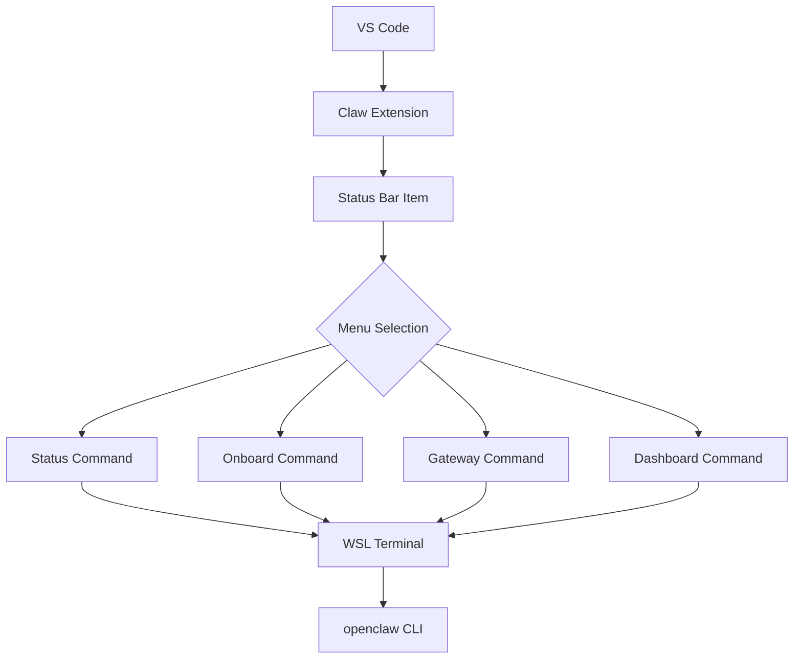

# Clawdbot Extension

A simple VS Code extension that manages Clawdbot connection status via a status bar item.

## Features

- **Status Bar Item**: Shows connection status with three states:
  - `$(plug) Clawdbot - Not connected (click to connect)`
  - `$(sync~spin) Connecting...` - Connection in progress
  - `$(check) Clawdbot - Connected to Clawdbot`

- **OS Detection**: Automatically detects the operating system and uses:
  - `wsl clawdbot status` on Windows
  - `clawdbot status` on other platforms

- **Auto-Connect**: Optional setting to automatically connect on startup (disabled by default)

## Usage

1. Click the Clawdbot status bar item (bottom right) to connect
2. The extension will open a terminal and execute the `clawdbot status` command
3. To enable auto-connect, go to Settings and enable `Clawdbot: Auto Connect`

## Workflow

## Development

1. Install dependencies: `npm install`
2. Compile: `npm run compile`
3. Press F5 to launch the Extension Development Host

## License
MIT
